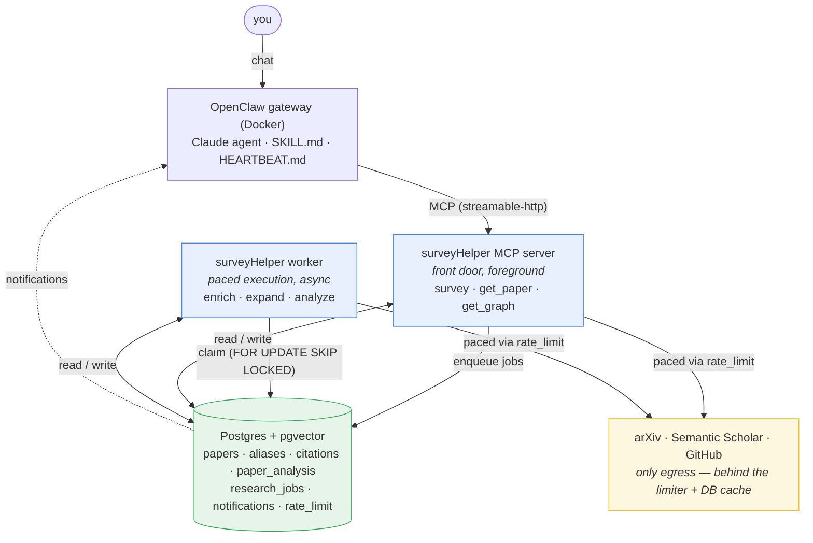
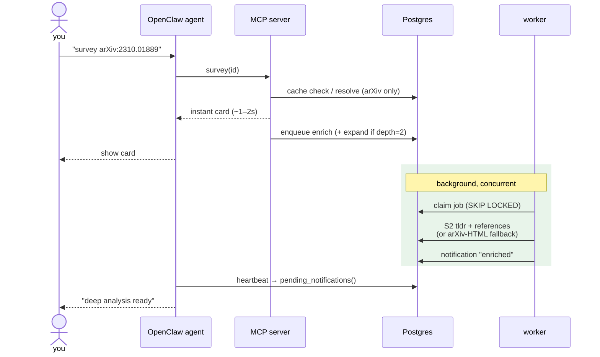

# surveyHelper — Architecture

How the running system fits together. For status, direction, and the locked decisions see
[`../ROADMAP.md`](../ROADMAP.md). (The original design draft and decision log are retired into
git history; code comments still cite their `plan §N` / `DECISIONS §X` section numbers as
rationale pointers.)

## Components (all local)



Three processes, one division of labor (plan §3):
- **MCP server** (`surveyhelper.mcp_server`) — the front door OpenClaw calls. Returns the
  instant card synchronously, enqueues background work. Stateless beyond the DB.
- **Worker** (`surveyhelper.worker`) — background daemon. Claims jobs `FOR UPDATE SKIP LOCKED`,
  runs them, notifies. Independent of whether OpenClaw is up.
- **Postgres+pgvector** — the memory *and* the coordination plane (job queue + rate-limit bucket).

## The two workflows, side by side



**Sync (foreground)** — `survey(id)` → ~1–2s:
1. parse identifier → `Ref`
2. DB-as-cache: if the card already exists, return it (no network)
3. step 0 resolve via **arXiv only** (never blocks on S2)
4. step 1 purpose — ladder: S2 `tldr` *(skipped here)* → abstract first sentences → none
5. step 3/7 from what's local; persist `paper` + `paper_analysis`
6. enqueue an `enrich` job; return the card

**Async (background)** — the worker drains jobs:
- **`enrich`** — fetch S2 `tldr` (upgrades step 1 → `ok`) and references (step 3 → graph edges).
  If S2 is throttled, defer with capped exponential backoff (`run_after`/`attempts`).
- **`analyze`** (Phase 2) — deep grounded steps via PaperQA2.
- *(future)* `expand` (BFS), `synthesize`, `proactive_scan`.

Both run **concurrently** and share one DB (memory) and one `rate_limit` bucket, so a burst of
foreground surveys automatically paces the background — never colliding into 429s.

## Key invariants
- **Single egress pacer.** Every paper-API call goes through `http.py` → the global `rate_limit`
  bucket. (PaperQA2 in Phase 2 must be network-isolated and fed via this layer — DECISIONS §H.)
- **DB-as-cache.** A stored paper/edge is never re-fetched (`paper_aliases` dedups every external id).
- **Per-step status.** Each step records `ok|partial|failed|skipped`; a paper missing S2 still yields
  a useful card (plan §4) rather than failing wholesale.
- **Versioned analysis.** `paper_analysis` is keyed by `pipeline_version` — a better model adds a row.
- **Resumable jobs.** Job state + frontier live in Postgres; a crash or budget-stop resumes, not restarts.

## Module map
```
surveyhelper/
  config · models (Pydantic) · logging_setup
  ratelimit (DB-backed bucket) · http (shared client + retry/backoff)
  db/      __init__(pool) · papers · analysis · jobs · notifications
  sources/ identifiers · arxiv · s2 · github
  pipeline/ resolve (step 0) · card (steps 0/1/3/7) · enrich (S2 async)
  worker · mcp_server
```
